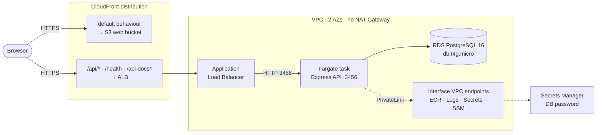

# BorrowIt on AWS

Migration of a peer-to-peer rental platform from Supabase hosting onto AWS,
defined end to end in CDK. An Express API runs on ECS Fargate behind an
Application Load Balancer, data lives in RDS PostgreSQL, and a React SPA is
served from S3 through CloudFront — which also fronts the API, so the whole app
is same-origin.

Region is `ap-southeast-1`. Everything is provisioned by `cdk deploy`; there are
no console steps.

## Architecture



The SPA and the API share one distribution deliberately. The ALB is HTTP-only,
and an HTTPS page cannot call an `http://` origin; separately, the session cookie
is `sameSite: 'strict'`, so any cross-site API host makes the browser silently
drop it — login returns 200 and every request after it is anonymous. Serving both
through one origin solves both problems, and CORS never enters into it. The
frontend therefore calls the API on **relative paths**: `VITE_API_URL` is
intentionally empty.

## Repository layout

| Path | What it is |
|---|---|
| [infra/](infra/) | CDK v2 app (TypeScript). Four stacks, deploy scripts, the full runbook. |
| [Renting-Online-Backend-main/](Renting-Online-Backend-main/) | Express + PostgreSQL API. Containerized, runs on Fargate. |
| [Renting-Online-Web-main/](Renting-Online-Web-main/) | React 19 + Vite + Tailwind SPA. Built and synced to S3. |

## Stacks

Split by how much each one costs rather than by what it does. Dependencies point
one way — `BorrowitApp` imports from the other three and nothing imports from it
— which is what makes tearing down just the expensive layer safe.

| Stack | Contents | ~$/month | Lifecycle |
|---|---|---|---|
| `BorrowitFoundation` | VPC, security groups, 5 interface VPC endpoints, ECR | **$36** | Leave up |
| `BorrowitData` | RDS PostgreSQL 16, Secrets Manager secret | $16 | Leave up — holds the data |
| `BorrowitFrontend` | web + uploads buckets, CloudFront | ~$0 | Leave up |
| `BorrowitApp` | ECS cluster, Fargate service, ALB, alarms, dashboard | **$31** | The one worth destroying on a long idle gap |

## Getting started

Prerequisites: AWS CLI v2 (authenticated), Docker running, Node.js 22, and the
Session Manager plugin for `aws ecs execute-command`.

```bash
cd infra
npm install
npx cdk bootstrap aws://<account>/ap-southeast-1
npx cdk deploy BorrowitFoundation BorrowitData BorrowitFrontend
# build and push the API image to ECR, then:
npm run up          # deploy the app and point CloudFront at the new ALB
npm run deploy:web  # build the SPA, sync to S3, invalidate the cache
```

**[infra/README.md](infra/README.md) is the real guide** — first deploy step by
step, loading the schema through `execute-command`, the daily workflow, every
context flag, the logging and alarm setup, and the known gaps.

Running the backend locally: copy
[Renting-Online-Backend-main/.env.example](Renting-Online-Backend-main/.env.example)
to `.env`, point `DATABASE_URL` at a local Postgres, then `npm run dev`. The Vite
dev server proxies `/api` to `localhost:3456`, which reproduces the same-origin
setup CloudFront provides in production.

## Design decisions that look like mistakes

These are deliberate. Reversing them either breaks the budget or breaks the app:

- **No NAT Gateway.** At ~$33/month it would cost more than everything else
  combined. Fargate tasks run in public subnets with public IPs; isolation comes
  from a security group that only accepts ingress from the ALB on port 3456. A
  public IP is not a public service.
- **Interface VPC endpoints are unconditional**, not feature-flagged. Image
  pulls, secret reads, log delivery and `execute-command` stay on PrivateLink
  rather than traversing the internet gateway. That is the $36/month in
  `BorrowitFoundation`, and it is the single largest saving available if it ever
  has to give.
- **No `errorResponses` on the distribution.** CloudFront custom error responses
  are distribution-wide, so a 403/404 → `index.html` rule would rewrite every API
  404 into the HTML app shell with status 200. SPA deep links are handled by a
  CloudFront Function scoped to the default behaviour instead.
- **The ALB hostname travels through SSM (`/borrowit/alb-dns`), not a
  CloudFormation export.** An export would reverse the stack dependency and make
  `cdk destroy BorrowitApp` fail on a value still in use. The lookup is
  synth-time on purpose so the literal hostname lands in the template — a
  deploy-time `{{resolve:ssm:...}}` reference looks tidier and is wrong, because
  an otherwise unchanged template reports "no changes" and keeps routing to a
  load balancer that no longer exists.
- **RDS storage autoscaling is pinned off** (`maxAllocatedStorage` equals
  `allocatedStorage`) so the bill cannot grow on its own. Multi-AZ is off by
  default and enabled per-deploy with `-c multiAz=true`.

## Secrets

The database password is generated by RDS straight into Secrets Manager and
injected into the task definition by `AppStack`. It never appears in a `.env`
file, a task definition literal, `cdk.json`, or this repository. Read it with:

```bash
aws secretsmanager get-secret-value --secret-id <arn>
```

## Notes

- The backend has no test suite (`npm test` exits 1). Changes are verified by
  running the app.
- `infra/cdk.context.json` is not tracked — it caches account-specific lookups
  that go stale. CDK regenerates it, and `npm run wire` refreshes the ALB entry.
- Cost figures are charged against AWS Free Plan credits. This account was
  created after the July 2025 free-tier change, so there is no 12-month free
  tier — every resource, RDS included, is paid for.
